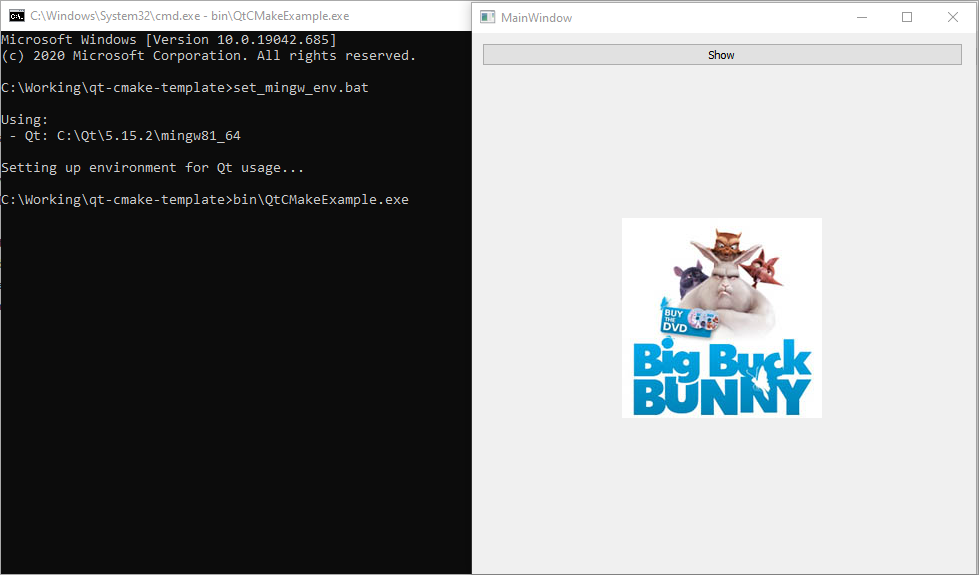

# Qt CMake Template

## Qt Creator
When using Qt Creator, *QT_MINGW_HOME* and *QT_MSVC_HOME* are ignored. Qt Creator's kits automatically set their *CMAKE_PREFIX_PATH*.

Qt Creator's default build directory is quite a awful.  
You can change it inside *Tools -> Options... -> Build & Run -> Default Build Properties* to:  
*e.g. %{JS: Util.asciify("build/%{CurrentBuild:Type}")}*

## Command line
### Compiling
Run *build_mingw.bat* or *build_msvc.bat* to compile the project. These automatically set up their respective build environments, so calling *set_mingw_env.bat* or *set_msvc_env.bat* beforehand is not necessary.

Any arguments passed to the batch file will get forwarded to CMake  
(*e.g. build_mingw.bat -DCMAKE_BUILD_TYPE=RELEASE*).

### MinGW
Create and set *QT_MINGW_HOME* Windows environment variable to point to:  
*e.g. C:\Qt\5.15.2\mingw81_64*

### MSVC
Download Qt's [jom](https://github.com/qt-labs/jom) CLI utility and add it to your Windows PATH environment variable.

Create and set *QT_MSVC_HOME* Windows environment variable to point to:  
*e.g. C:\Qt\5.15.2\msvc2019_64*

Create and set *VC_HOME* Windows environment variable to point to your Visual Studio's *vcvarsall.bat* location:  
*e.g. C:\Program Files (x86)\Microsoft Visual Studio\2019\Community\VC\Auxiliary\Build*

### Running the binary
When trying to run the binary from the CLI you may experience DLL errors. To mitigate this, run your compiler's *set_xxx_env.bat* and then run your application.

